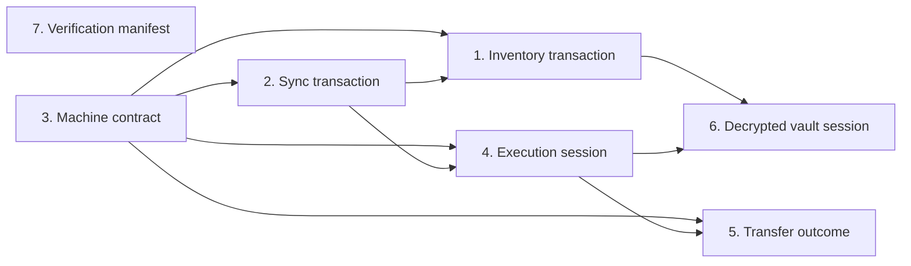

# SSM v2 Architecture Audit

<!-- markdownlint-configure-file {"MD024": {"siblings_only": true}} -->

Status: proposed architecture plan, with no runtime changes

Audited branch: `docs/architecture-audit-v2`

Audited commit: `eef46a7c6544`

Comparison base: `origin/agent-headless-sync` at `eef46a7c6544`

## Executive decision

The repository has several deep implementation modules worth preserving. The
main architecture problem is above those mechanisms: `cmd/ssm` repeatedly
assembles sync freshness, decrypted inventory, mutation publication, machine
contracts, and SSH process lifetime. That policy is distributed across command
paths, so changes with one public meaning require edits in several places.

This audit recommends seven candidates:

1. **Inventory transaction module** — **Strong**
2. **Sync transaction module** — **Strong**
3. **Machine contract module** — **Strong**
4. **Process-scoped execution session** — **Worth exploring**
5. **Unified transfer outcome** — **Worth exploring**
6. **Decrypted vault session** — **Speculative**
7. **One verification manifest** — **Worth exploring**

The first implementation work should freeze public behavioral seams. Candidate
7 is independent and can be done early. Candidate 6 should be attempted only
after Candidates 1 and 4 demonstrate stable, narrower seams.

## Scope and method

The audit read:

- `AGENTS.md`, `CONTEXT.md`, and every file under `docs/agents/`;
- `README.md`, `README.en.md`, `SECURITY.md`, and
  `skills/agent-ssm/README.md`;
- `skills/agent-ssm/SKILL.md`;
- both GitHub Actions workflows, `Makefile`, and `go.mod`;
- all Go source and tests under `cmd/` and `internal/`;
- the SSH integration matrix and release/update implementation;
- the 25 commits from `v1.3.0` through `eef46a7c6544`.

The repository contains 93 tracked files, 67 Go files, and 24 Go test files.
Those counts describe scope only; they did not determine any recommendation.

Each finding uses the deletion test:

> If the proposed module disappeared, would meaningful policy have to spread
> back into multiple callers?

A candidate is not justified by a large file, a preferred directory shape, or
a desire to add interfaces for tests. The proposed interfaces below are module
interfaces. They do not imply exported Go interface types unless two production
implementations actually need substitution.

## Baseline and repository map

### Package map

- `cmd/ssm` owns public CLI parsing, process exit, command orchestration,
  machine output, inventory mutation workflow, and process-scoped streaming.
- `internal/config` owns on-disk paths, encrypted vault serialization, private
  file writes, settings, redirects, merge reports, and the inventory data
  structures.
- `internal/vault` owns the versioned Argon2id and AES-GCM byte format.
- `internal/cloud` owns sync HTTP transport, encrypted blob transfer, cached
  ETags, and two-sided conflict detection.
- `internal/ssh` owns command construction, SSH authentication, host-key
  verification, pooling, execution, map, diagnostics, and transfer protocols.
- `internal/syncserver` owns the authenticated opaque-blob sync service.
- `internal/update` owns release discovery, platform asset selection, checksum
  verification, and executable replacement.

The current import direction is mostly acyclic:

```text
cmd/ssm
  -> internal/cloud -> internal/config -> internal/vault
  -> internal/ssh   -> internal/cloud, internal/config
  -> internal/syncserver
  -> internal/update -> internal/config
```

The notable exception in responsibility, not in the Go import graph, is
`internal/ssh.Doctor`: it computes sync state through `internal/cloud` and
`internal/config`, while `cmd/ssm` computes similar state for `status`.

### Change evidence

The highest recent churn from `v1.3.0` through the audited commit is at
behavioral integration points:

- `cmd/ssm/connections.go`: 483 added/deleted lines;
- `cmd/ssm/cloud.go`: 267 added/deleted lines;
- `internal/ssh/resume.go`: 258 added/deleted lines;
- `scripts/ssh_matrix_test.sh`: 216 added/deleted lines;
- `cmd/ssm/main.go`: 202 added/deleted lines;
- `cmd/ssm/stream.go`: 190 added lines;
- `cmd/ssm/sshctl.go`: 185 added/deleted lines;
- `cmd/ssm/transactions.go`: 183 added/deleted lines;
- `internal/ssh/filecopy.go`: 177 added/deleted lines.

Recent commits explain why these are changing:

- `ea8fc19` added scoped inventory transactions;
- `2634554` exposed freshness and offline state;
- `975e5e2` normalized machine-readable errors;
- `ab7f7ce` made regular-file upload atomic and observable;
- `37086a4` added resumable upload;
- `6be0518` added persistent execution and pooling;
- `888b562` fixed unlock ordering before push.

This is evidence of concentrated policy evolution, not evidence that the files
should merely be split.

### Test baseline

The requested pre-write suite passed. Package statement coverage was:

- `cmd/ssm`: 38.8%;
- `internal/cloud`: 57.8%;
- `internal/config`: 57.9%;
- `internal/ssh`: 42.5%;
- `internal/syncserver`: 69.8%;
- `internal/update`: 62.6%;
- `internal/vault`: 0.0%.

The coverage profile is diagnostic only. More important is that many command
orchestrators are not exercised through the compiled CLI. For example,
`runHostCommand`, `pushTransactionScope`, `runPutWithOptions`,
`runSSHCTLStatus`, and the successful live stream path reported 0% in the
supplemental function profile. Existing tests cover important mechanisms, but
some stable public compositions remain implicit.

## Hard contracts

These constraints are architecture inputs, not refactoring opportunities.

### CLI and automation

- Public command names, arguments, help output, and compatibility aliases are
  stable interfaces.
- Neither `ssm` nor `sshctl` may open a TUI, an interactive shell, or wait for
  terminal input.
- Exact aliases are required. Suggestions may be returned, but never selected
  automatically.
- `sshctl request` schema version 1 is strict and rejects unknown fields.

These contracts are documented in `CONTEXT.md:33-39`,
`README.en.md:3-4`, and `cmd/ssm/request.go:55-209`.

### Sync freshness and offline behavior

- Online inventory operations refresh before reading.
- A refresh failure stops the operation.
- Cached inventory is used only after an explicit `--offline` choice.
- A two-sided ETag conflict preserves both encrypted blobs.

See `CONTEXT.md:14-17`, `CONTEXT.md:57-60`,
`cmd/ssm/sync_test.go:12-45`, and
`internal/cloud/cloud_test.go:95-131`.

### Reviewed mutation publication

- A successful reviewed host mutation returns a stable transaction ID.
- `push --only <transaction-id>` publishes exactly that reviewed scope.
- Unrelated pending mutations remain local.
- Bare `push` and `push --all` remain compatibility paths for deliberate
  publication of every pending mutation.
- A push failure leaves the local mutation pending.

See `CONTEXT.md:24-29`, `CONTEXT.md:61-64`,
`cmd/ssm/transactions_test.go:62-137`, and
`README.en.md:78`.

### Structured output and failure taxonomy

- Normal JSON commands emit exactly one JSON value.
- `run --stream` emits one compact NDJSON result per non-empty input line.
- `error`, `stage`, `exit`, and `hint` have stable meanings.
- Connection failure commonly exits 255, but a remote process may also exit
  255; callers must inspect the structured failure class.
- Secret values must be redacted from messages, hints, command plans, and
  structured output.

See `CONTEXT.md:67-73`, `skills/agent-ssm/SKILL.md:23-28`,
`internal/ssh/errors.go:17-43`, and `cmd/ssm/machine.go:9-45`.

### Security

- Sync transfers and stores only opaque encrypted vault blobs.
- Passwords, private keys, tokens, `cloud.json`, `master.pass`, and decrypted
  vault contents must not be printed or committed.
- Host-key verification is explicit: inspect, verify out of band, then accept
  the exact observed fingerprint with explicit confirmation.
- Scoped publication must never be widened silently.
- Local secret-bearing files remain private and are replaced atomically where
  required.

See `CONTEXT.md:41-46`, `SECURITY.md`,
`internal/cloud/cloud.go:111-146`, and
`internal/ssh/hostkey_test.go:12-78`.

### Cross-platform, update, and release

- The public CLI supports Linux, macOS, and Windows behavior.
- Release assets cover Linux, macOS, and Windows on amd64 and arm64.
- The source version must match the release tag.
- The updater selects the same platform naming scheme, verifies the named
  SHA-256 entry before replacement, and leaves the old executable intact on a
  checksum mismatch.

See `.github/workflows/release.yml:57-91`,
`internal/update/update.go:77-155`, and
`internal/update/update_test.go:106-175`.

## Existing deep modules to preserve

### Versioned vault cryptography

`internal/vault` presents only `Encrypt` and `Decrypt` while hiding the version
byte, salt, Argon2id parameters, nonce, and AES-GCM format
(`internal/vault/vault.go:16-91`). Deleting it would spread cryptographic format
policy into persistence callers. Keep it small and deep.

The missing direct package tests are a test gap, not a reason to redesign the
cryptographic format.

### Private atomic file writer

`internal/config.WritePrivateFile` centralizes private-directory creation,
temporary-file permissions, sync, close, and rename. Deleting it would spread
security-sensitive write sequences across config and cloud metadata. Preserve
the module.

### Host-key trust workflow

`internal/ssh` hides handshake-only inspection, exact fingerprint matching,
known-host replacement, and atomic publication behind inspect and accept
operations. The tests demonstrate that mismatches are not accepted implicitly
(`internal/ssh/hostkey_test.go:12-78`). Preserve this module and its explicit
public workflow.

### SSH pool

`internal/ssh/pool.go:122-198` hides stale-client retry, per-destination
serialization, session acquisition, and process-wide closure. The integration
test proves two commands use one connection and exactly two command sessions
(`internal/ssh/run_integration_test.go:117-145`). The pool is deep; the shallow
seam is who owns its lifetime.

### Script preparation and transport

`internal/ssh/script.go` hides shell detection, size and encoding checks,
argument quoting, preflight construction, stdin transport, digesting, and
secret redaction. Removing it would recreate safety policy in run, map, and
request parsing. Preserve it as a separate module from generic execution.

### Atomic and resumable upload protocols

`internal/ssh/filecopy.go` and `internal/ssh/resume.go` hide temporary remote
paths, byte receipts, optional checksums, timeout cleanup, resumable state, and
atomic final publication. Those are protocol modules, not helpers. Preserve
their protocol logic even if their outward result interface is unified.

### Opaque sync server

`internal/syncserver` owns authentication, request bounds, constant-time token
comparison, and private opaque-blob storage. It has no reason to know inventory
or vault plaintext. Preserve that separation.

### Update downloader

`internal/update.DownloadVersion` hides asset selection, checksum lookup,
temporary executable creation, verification, and rename
(`internal/update/update.go:77-146`). Tests prove mismatch-before-replace and
successful replacement. Preserve this implementation module.

## Shallow and leaky findings

### Inventory transaction policy is command-local

`runHostCommand` performs refresh, load, mutation, optional SSH verification,
transaction creation, encrypted save, optional scoped push, and result shaping
in one command path (`cmd/ssm/hosts.go:316-403`).

The mutation ledger itself is split:

- secret-bearing snapshots live in general config types
  (`internal/config/config.go:29-50`);
- append and projection live in `cmd/ssm/transactions.go:28-150`;
- pending rebasing lives in `cmd/ssm/transactions.go:157-176`;
- pre-save, encrypted projection, remote push, and rollback live in
  `cmd/ssm/cloud.go:183-220`.

Legacy `ssm remove` directly edits the raw vault, saves, and calls auto-push
(`cmd/ssm/connections.go:66-91`). Bulk import also writes the inventory outside
the reviewed transaction path (`cmd/ssm/connections.go:554-610`). These may be
intentional compatibility paths, but their policy is not local.

### Sync policy has multiple owners

Generic commands use `refreshVaultIfChangedResult`, which treats every
`LoadCloud` error as if sync were not configured
(`cmd/ssm/cloud.go:298-310`). Host commands independently probe for
`cloud.json` and propagate malformed configuration
(`cmd/ssm/hosts.go:405-424`). Tests pin the host behavior but do not compare it
with every generic command (`cmd/ssm/hosts_test.go:327-342`).

`status` computes freshness, remote state, cache age, and pending state in
`cmd/ssm/sshctl.go:310-384`. `Doctor` computes overlapping sync state in
`internal/ssh/doctor.go:44-82`. Cloud transport also mutates local vault,
cached ETag, conflict record, and last-sync settings
(`internal/cloud/cloud.go:149-253`).

### Machine contracts are structurally duplicated

The canonical taxonomy is declared in `internal/ssh/errors.go:17-43`, while
callers also construct:

- `machineErrorOutput` in `cmd/ssm/machine.go:14-45`;
- `hostCLIError` and a second mapping switch in
  `cmd/ssm/hosts.go:79-112`;
- special verification and push envelopes in
  `cmd/ssm/hosts.go:799-849`;
- upload failure envelopes in `cmd/ssm/connections.go:328-365`;
- stream errors in `cmd/ssm/stream.go:176-184`;
- command-specific result types in `internal/ssh`.

The existing tests assert some stable fields and constants, but not one
cross-command matrix of code, stage, exit, hint, redaction, and cardinality.

### Process lifetime leaks into stream orchestration

`runArgvStream` owns refresh cadence, raw vault reload, global pool closure,
alias lookup through `executeRunSpec`, NDJSON framing, and aggregate process
exit (`cmd/ssm/stream.go:74-149`). The unit test covers invalid input and a
missing alias, but not successful multi-command reuse, refresh failure after a
successful result, or inventory-change redial at the public stream seam
(`cmd/ssm/stream_test.go:61-90`).

One-shot run and map separately assemble alias resolution and execution options
(`cmd/ssm/connections.go:94-253`). The pool mechanism is deep, but the
process-scoped execution module is missing.

### Transfer result depth is uneven

Regular upload returns `TransferResult` and `TransferError`
(`internal/ssh/filecopy.go:20-47`). Directory upload returns that result only at
its outer dispatch, while its implementation returns raw errors. Download
returns only `error` (`internal/ssh/dirsync.go:15-48`).

The CLI manually maps upload failures into another JSON struct and maps
download failures through only the generic SSH classifier
(`cmd/ssm/connections.go:315-395`). This makes the public result contract harder
to evolve consistently across file, directory, upload, download, and resume.

### Decrypted state crosses broad seams

The process stores `masterPass` and an unlocked raw `*config.Vault` in package
globals. `loadVault` consumes that snapshot once, then decrypts from disk again
(`cmd/ssm/main.go:294-368`). Many SSH functions receive the entire decrypted
vault to resolve one credential.

This is a security-locality concern, but the current data structure is also the
shared substrate for inventory, pending mutations, merge, sync, and SSH. A
premature wrapper would add forwarding methods without deleting policy.

### Local and CI verification drift

`make check` runs a mutating `gofmt -w`, lint, and build only
(`Makefile:14-20`). CI uses a non-mutating format check and additionally runs
vet, vulnerability scanning, unit tests, race tests, artifact syntax checks,
and the live SSH matrix (`.github/workflows/ci.yml:22-67`).

Release has separate version, platform, artifact, checksum, and release-note
rules (`.github/workflows/release.yml:27-130`). The updater currently matches
the release asset naming scheme, but that agreement is maintained by review,
not a shared verification contract.

## Ranked candidates

## 1. Inventory transaction module

Class: **Strong**

### Evidence

- One reviewed mutation crosses `hosts.go`, `transactions.go`, `config`, and
  `cloud.go`.
- Projection and rollback are part of one user-visible atomicity promise, but
  are implemented in separate modules.
- Pending mutations carry full key snapshots, including private material
  (`internal/config/config.go:41-50`), so publication logic is
  security-sensitive.
- Same-alias ordering is enforced at projection time
  (`cmd/ssm/transactions.go:81-96`), while shared-key dependencies are encoded
  only indirectly through full key deltas.
- The recent scoped-transaction feature and push-unlock fix both changed this
  integration seam.
- Legacy remove and key removal still bypass reviewed mutation publication.

### Current interface

Callers manually compose `mutateHost`, `appendHostMutation`,
`config.Save`, `publishProjection`, `config.EncryptVault`,
`cloud.PushBlob`, `markPublished`, and compensating `config.Save`.

### Proposed module interface

Introduce a concrete inventory transaction module with a narrow external
interface such as:

```go
Apply(change InventoryChange, verify VerifyPolicy) (MutationReceipt, error)
Pending() ([]PendingMutationView, error)
Publish(scope PublishScope) (PublicationReceipt, error)
```

The module owns:

- candidate inventory construction and validation;
- optional candidate verification sequencing;
- pending-base and mutation-ledger invariants;
- scoped dependency validation and projection;
- encrypted local commit, opaque remote publication, and rollback;
- secret-free receipts and pending views.

Keep command parsing and rendering outside. Keep the sync transport opaque and
the vault crypto implementation below the module.

### Leverage and locality gain

Deleting this module would force every mutation caller to recreate reviewed
change ordering, pending-ledger rules, scoped projection, secret filtering, and
failure rollback. That is meaningful leverage. It also makes one place
responsible for the rule that unrelated changes never enter a scoped blob.

### Public behavioral test seam

Use a compiled-CLI harness with a temporary home and an HTTP sync server:

- apply two mutations, publish the second, decrypt the captured blob in the
  test, and prove only the reviewed inventory is present;
- prove the first transaction remains pending locally;
- prove a failed PUT leaves the same transaction ID pending;
- prove dependent publication is rejected before network I/O;
- prove structured preflight contains no password or private key;
- exercise `host.add`, `host.update`, `host.upsert`, and `host.remove`;
- explicitly characterize legacy `ssm remove`, key removal, and bulk import.

### Expand–migrate–contract

1. **Expand:** add the module behind current functions and add subprocess
   contract tests. Keep old transaction serialization unchanged.
2. **Migrate:** move host mutation and scoped push first. Compare old and new
   projections in tests. Migrate legacy mutation entry points only after their
   compatibility behavior is decided.
3. **Contract:** delete command-level projection, rebasing, rollback, and
   duplicate secret-free view construction. The deletion is the proof of depth.

### Compatibility and security risk

Risk is high. A projection error can publish unrelated credentials or lose a
pending change. Mutation IDs, JSON fields, encrypted on-disk data, push-all
compatibility, exact aliases, and failure recovery must remain stable.

### Dependencies

- Candidate 2 should provide the opaque publication and freshness behavior.
- Candidate 3 should provide canonical failure construction and rendering.

### Non-goals

- Do not change the vault encryption format.
- Do not change public transaction IDs or JSON fields.
- Do not silently convert bare push to scoped push or vice versa.
- Do not turn bulk import into a sequence of host mutations without an
  explicit compatibility decision.

## 2. Sync transaction module

Class: **Strong**

### Evidence

- Generic and host commands implement different cloud-configuration error
  behavior.
- Refresh, conflict detection, local blob replacement, ETag persistence,
  cache invalidation, settings timestamps, and status calculation span
  `cmd/ssm`, `internal/cloud`, and `internal/config`.
- `status` and `doctor` independently derive overlapping state.
- Stream repeats refresh and cache invalidation policy inside its input loop.
- No-silent-offline and conflict-preservation tests already show that this is a
  stable behavioral unit.

### Current interface

Callers use `refreshVaultIfChanged`, `refreshHostVault`,
`cloud.PullIfChanged`, `cloud.Pull`, `cloud.PushBlob`,
`cloud.LocalVaultETag`, `cloud.CachedRemoteETag`, settings timestamps, and
explicit cache invalidation.

### Proposed module interface

Introduce one concrete sync transaction module:

```go
Refresh(policy RefreshPolicy) (RefreshOutcome, error)
Pull() (SyncOutcome, error)
Push(encryptedBlob []byte) (SyncOutcome, error)
Status(policy StatusPolicy) SyncStatus
```

It owns the sequence around the existing HTTP mechanism:

- configured, disabled, online, and explicit-offline decisions;
- HEAD comparison and two-sided conflict preservation;
- atomic opaque local-blob replacement;
- ETag, conflict record, and last-operation metadata;
- one freshness and remote-state vocabulary;
- notification that an in-process decrypted snapshot is invalid.

Do not introduce a remote-store Go interface solely for tests. The existing
injectable HTTP client and `httptest.Server` are adequate until a second real
transport exists.

### Leverage and locality gain

Deleting the module would spread the no-silent-offline rule, conflict
preservation, freshness vocabulary, and cache invalidation back into list,
run, map, put, get, check, doctor, status, host mutation, and stream. That is a
high-leverage seam.

### Public behavioral test seam

Run compiled commands against a temporary sync server and assert:

- every online inventory command stops on an unreachable endpoint;
- explicit `--offline` skips all network requests;
- malformed `cloud.json` has one characterized outcome across commands;
- a changed remote blob invalidates the decrypted snapshot;
- a two-sided conflict performs no GET and preserves local data;
- `status` and `doctor` describe the same cached state vocabulary;
- stream emits one terminal sync failure and stops.

### Expand–migrate–contract

1. **Expand:** add `RefreshOutcome` and `SyncStatus`; make them observable in
   new subprocess tests without changing current JSON.
2. **Migrate:** route generic refresh, host refresh, status, doctor, and stream
   through the module one at a time.
3. **Contract:** remove command-owned cloud probing, duplicate freshness
   calculations, and manual cache invalidation.

### Compatibility and security risk

Risk is high. Silent offline fallback, accidental overwrite during conflict,
different malformed-config behavior, or plaintext exposure would violate hard
contracts. The module must continue moving opaque encrypted bytes only.

### Dependencies

- Candidate 3 for canonical sync failures.
- Candidate 1 consumes the push operation but should not own ETag policy.

### Non-goals

- Do not add background synchronization.
- Do not merge plaintext inventories in the sync transport.
- Do not change the sync server protocol or authentication.
- Do not remove explicit pull, push-all, or offline compatibility behavior.

## 3. Machine contract module

Class: **Strong**

### Evidence

- Stable error values exist, but mapping and envelope construction are
  duplicated across generic errors, host errors, execution, transfer,
  host-key, check, doctor, and stream.
- There are three real output adapters: JSON document, NDJSON, and human text.
- Current tests pin constants and selected shapes, not a complete
  cross-command taxonomy.
- The public documentation instructs automation to classify with `ok`,
  `error`, and `stage`, not process exit alone.

### Current interface

Callers construct command-specific structs, choose codes and stages manually,
call one of several writers, and call `os.Exit` separately.

### Proposed module interface

Create a contract module centered on shared metadata:

```go
type Failure struct {
    Code, Stage, Message, Hint, Alias string
    Exit int
    Candidates []string
}

Classify(kind FailureKind, context FailureContext) Failure
RenderJSON(result any) error
RenderNDJSON(writer io.Writer, result any) error
RenderHuman(writer io.Writer, result any) error
```

Command-specific success payloads remain typed. They embed or compose the same
failure metadata instead of replacing all results with one generic envelope.
Redaction occurs before any renderer.

### Leverage and locality gain

Deleting this module would force every command to reconstruct the canonical
code, stage, exit, hint, redaction, and output-cardinality rules. The module
centralizes the public compatibility policy without erasing useful
command-specific results.

### Public behavioral test seam

Build a table-driven subprocess suite over invalid arguments, unlock failure,
alias miss, sync pull conflict, host verification failure, transfer failure,
host-key mismatch, remote exit 255, and stream decode failure. Assert:

- exact `error`, `stage`, `exit`, and non-empty safe `hint`;
- JSON document cardinality or NDJSON line cardinality;
- stdout/stderr placement;
- absence of injected passwords, keys, tokens, and passphrase fragments;
- remote exit 255 remains distinguishable from a connection failure.

### Expand–migrate–contract

1. **Expand:** add the shared failure type and golden/subprocess matrix. Adapt
   existing values without changing serialized fields.
2. **Migrate:** generic errors, host errors, stream, transfer, host-key, then
   SSH results.
3. **Contract:** delete duplicate switches, anonymous failure structs, and
   redundant JSON writers. Keep command-specific success types.

### Compatibility and security risk

Risk is high because tiny field, omission, stream-format, or exit changes break
automation. Redaction must happen once before all adapters, and JSON field
omission must remain compatible.

### Dependencies

This candidate is foundational for Candidates 1, 2, 4, and 5.

### Non-goals

- Do not rename stable fields or error codes.
- Do not make every command return the same success payload.
- Do not infer connection failure from exit 255 alone.
- Do not add an output framework with only one adapter.

## 4. Process-scoped execution session

Class: **Worth exploring**

### Evidence

- `runArgvStream` manually owns refresh, vault reload, global pool invalidation,
  execution, framing, and process exit.
- One-shot run and map separately resolve aliases and construct run options.
- `internal/ssh.Run` accepts a connection plus the entire raw vault and a broad
  options structure (`internal/ssh/run.go:25-68`).
- The deep pool has a process lifetime, but callers can only close all pooled
  clients globally.
- Live integration tests prove pool reuse, while public stream tests do not
  cover the successful persistent path.

### Current interface

Callers combine `resolveConnection`, `executeRunSpec`, `ssh.Map`,
`ssh.Run`, `ssh.ClosePool`, raw `*config.Vault`, and refresh helpers.

### Proposed module interface

Introduce a concrete process-scoped execution session:

```go
OpenExecutionSession(snapshot ResolvedInventory) (*ExecutionSession, error)
(*ExecutionSession).Run(request RunRequest) RunResult
(*ExecutionSession).RunMany(requests []RunRequest, workers int) []RunResult
(*ExecutionSession).ReplaceInventory(snapshot ResolvedInventory)
(*ExecutionSession).Close() error
```

It owns exact alias resolution, credential lookup, script preflight sequencing,
and the lifetime of the existing pool. Replacing inventory closes only clients
whose connection or credential identity changed, if that narrower behavior is
proven safe; closing all remains the compatible first migration.

### Leverage and locality gain

The module makes process lifetime explicit. Deleting it would spread alias,
credential, preflight, and pool-invalidation policy back across one-shot run,
map, check, doctor, transfer, and stream.

### Public behavioral test seam

Extend the in-process SSH server into a compiled stream test:

- two successful NDJSON commands use one TCP connection and two sessions;
- each input line produces exactly one result in order;
- a remote non-zero result does not corrupt the next command;
- refresh failure emits one terminal result and stops;
- changed address or credential causes a redial before the next command;
- removed alias stops without selecting a suggestion;
- `--no-reuse` opens a new connection for each request.

### Expand–migrate–contract

1. **Expand:** wrap current resolution and pool calls without changing pool
   implementation. Add live public stream tests.
2. **Migrate:** stream first, then one-shot run, map, check, and doctor.
   Transfer migration waits for Candidate 5.
3. **Contract:** delete command-level pool closure and duplicate run-option
   assembly. Keep low-level SSH protocol modules internal to the session.

### Compatibility and security risk

Risk is medium-high. Reusing a client after host, user, key, password, port, or
host-key state changes can cross a security identity. Refresh failure must
still stop the stream. Ordering, output cardinality, and exact aliases remain
public contracts.

### Dependencies

- Candidate 2 supplies refreshed inventory outcomes.
- Candidate 3 supplies result and failure metadata.

### Non-goals

- Do not add an interactive shell.
- Do not keep connections alive across processes.
- Do not weaken host-key verification.
- Do not merge script parsing, transfer protocols, and host-key trust into one
  giant SSH package interface.

## 5. Unified transfer outcome

Class: **Worth exploring**

### Evidence

- Regular upload has a detailed outcome and classified error.
- Directory upload, download, and the command adapter have different result
  depth.
- Resume exposes `bytes_reused`, while the command's failure envelope rebuilds
  only part of the transfer result.
- Download's directory probe falls back to file download on any probe error
  (`internal/ssh/dirsync.go:38-48`), so classification policy is implicit.
- Public documentation promises specific stage, integrity, atomicity, and
  resume semantics for regular-file put.

### Current interface

The surface includes `UploadFile`, `UploadFileWithOptions`,
`UploadPathWithOptions`, `DownloadFile`, `DownloadPath`,
`TransferResult`, `TransferError`, raw `error`, and command-owned JSON mapping.

### Proposed module interface

Present one concrete transfer module:

```go
Transfer(request TransferRequest) TransferOutcome
```

`TransferRequest` distinguishes put/get, file/directory discovery, paths,
resume version, checksum, and timeout. `TransferOutcome` always carries common
failure metadata plus direction, kind, stage, bytes transferred or reused,
integrity, atomicity, and resume capability where meaningful.

Keep regular upload and resumable upload as deep internal protocol
implementations. Do not force directory transfer to claim guarantees it does
not provide.

### Leverage and locality gain

Deleting the module would spread transfer-kind dispatch, SSH classification,
outcome construction, atomicity claims, and rendering conversion back into
commands and protocol files.

### Public behavioral test seam

Using the existing SSH test server, exercise compiled `put`, `get`, and request
schema paths for:

- regular success with size and optional SHA-256;
- resume success and `bytes_reused`;
- timeout, integrity mismatch, and permission failure;
- directory success with `atomic:false` and unavailable integrity;
- download failure without a partial final local file;
- JSON field parity between direct CLI and typed request.

### Expand–migrate–contract

1. **Expand:** add `TransferOutcome` as an adapter over existing upload
   protocols. Pin current regular-file JSON.
2. **Migrate:** put and resumable put, then directory put, then get.
3. **Contract:** remove command-owned anonymous transfer errors and raw
   download-only classification. Keep protocol-specific internal types if they
   simplify implementation.

### Compatibility and security risk

Risk is medium. Incorrect atomicity or integrity claims are more dangerous than
missing fields. Remote paths and local secret-bearing paths must remain
redacted where required. Retry and resume state must never publish a partial
destination.

### Dependencies

- Candidate 3 for common failure metadata and rendering.
- Candidate 4 if transfer adopts the process-scoped SSH session.

### Non-goals

- Do not make directory transfer atomic by declaration.
- Do not replace the resumable v1 protocol.
- Do not add SCP or another transport without a real requirement.
- Do not change public put/get argument order.

## 6. Decrypted vault session

Class: **Speculative**

### Evidence

- `masterPass` and `unlockedVault` are process globals.
- Commands and SSH functions pass raw secret-bearing `*config.Vault`.
- Inventory, credentials, pending mutation metadata, and persistence format are
  represented by one structure.
- `internal/vault` has no direct tests, although config tests exercise encrypted
  save/load.

This is a broad security-locality concern, but it is not yet evidence for a
large replacement.

### Current interface

`unlock`, `loadVault`, `config.Load`, `config.Save`, and
`config.EncryptVault` expose passphrase and raw decrypted structures to many
callers.

### Proposed module interface

Only after Candidates 1 and 4, evaluate a concrete session:

```go
Unlock(passFile SecretFile) (*VaultSession, error)
(*VaultSession).InventoryView() InventoryView
(*VaultSession).ResolveCredential(alias string) CredentialHandle
(*VaultSession).Transactions() *InventoryTransactions
(*VaultSession).Close()
```

The credential handle should provide authentication material to the SSH module
without exposing the full vault. It must not become a generic getter for raw
secrets. Avoid an exported Go interface while only one encrypted store exists.

### Leverage and locality gain

The candidate is worthwhile only if callers stop receiving the raw vault and
the global passphrase disappears. If the session merely forwards
`Load`, `Save`, and `Vault()`, the deletion test fails and the candidate should
be rejected.

### Public behavioral test seam

Before internal migration, pin:

- creation and unlock through a private master-pass file;
- old `[]Connection` encrypted-format migration;
- save permissions and atomic replacement;
- all inventory, run, transfer, and mutation JSON for secret absence;
- wrong-password and malformed-vault error contracts;
- Linux, macOS, and Windows path behavior.

Add direct known-format round-trip and tamper tests inside `internal/vault`,
without changing cryptographic parameters or serialized bytes.

### Expand–migrate–contract

1. **Expand:** add direct crypto/persistence characterization tests and a
   concrete session wrapping current behavior.
2. **Migrate:** credential resolution and execution first, then inventory
   transactions. Measure whether raw-vault call sites actually disappear.
3. **Contract:** remove global passphrase/decrypted-vault state and raw vault
   parameters. Abort the candidate if this contraction is not achievable.

### Compatibility and security risk

Risk is very high. On-disk compatibility, KDF cost, authenticated encryption,
passphrase lifetime, permissions, and migration behavior are security
contracts. A wrapper that lengthens secret lifetime is a regression.

### Dependencies

- Candidate 1 must first own inventory transactions.
- Candidate 4 must first own execution lifetime and credential consumption.

### Non-goals

- Do not change AES-GCM, Argon2id, parameters, version bytes, or file format.
- Do not introduce a keyring, daemon, or remote decryption service.
- Do not sync plaintext or credential handles.
- Do not proceed unless the migration deletes raw-vault seams.

## 7. One verification manifest

Class: **Worth exploring**

### Evidence

- `make check` is mutating and omits most CI checks.
- CI and release independently specify Go versions and build commands.
- CI does not currently run the requested coverage command.
- Release and updater asset naming agree by convention across workflow YAML and
  Go code.
- The live SSH matrix is a public behavioral gate but is not reachable through
  the local `check` target.

### Current interface

Maintainers choose among `make check`, ad hoc Go commands, CI workflow steps,
the SSH matrix script, and release workflow logic. The same word "check" does
not mean the same verification set locally and remotely.

### Proposed module interface

Create one checked-in, cross-platform verification driver with named profiles:

```text
verify fast
verify ci
verify release
verify list
```

The manifest or driver owns exact non-mutating commands, tool versions, and
profile membership. `Makefile` and GitHub Actions become two real adapters.
The release profile validates source/tag version, platform asset names, update
asset selection, release notes, and checksums without publishing anything.

Prefer a small Go driver if cross-platform local execution is required. Do not
add a production Go interface for build tooling.

### Leverage and locality gain

Deleting the driver would force Make, CI, and release preflight to duplicate
command membership and asset-contract policy. One profile makes "passed the
same gate" meaningful.

### Public behavioral test seam

- `verify list` is snapshot-tested so profile drift is reviewed.
- `verify ci` is non-mutating and includes format, lint, vet, vulnerability,
  build, test, race, artifact validation, and the SSH matrix where dependencies
  are present.
- `verify release` compares every release platform asset with updater
  selection and refuses source/tag mismatch.
- A clean-tree assertion proves verification creates no tracked changes.

### Expand–migrate–contract

1. **Expand:** add the driver and make it print exact commands. CI runs it in
   comparison mode alongside existing steps.
2. **Migrate:** make local and CI adapters invoke profiles. Add release
   preflight without publishing.
3. **Contract:** delete duplicated command lists after parity is proven. Keep
   GitHub permissions and release publication explicit in workflow YAML.

### Compatibility and security risk

Risk is low-medium. Tool availability and platform differences can make a
local profile unusable. Release validation must not gain permission to tag,
publish, or replace artifacts. Verification must remain non-mutating.

### Dependencies

Independent of runtime candidates. It can provide safer gates for all of them.

### Non-goals

- Do not merge, tag, release, or publish from the verification driver.
- Do not make coverage percentage a gate without a maintainer decision.
- Do not hide GitHub permissions or environment setup in opaque tooling.
- Do not change updater trust or release signing in this candidate.

## Dependency graph and implementation order



Recommended order:

1. Add the public subprocess contract harness.
2. Implement Candidate 7 independently so later work has one gate.
3. Implement Candidate 3 without changing serialized output.
4. Implement Candidate 2 and migrate all freshness callers.
5. Implement Candidate 1 using Candidate 2's opaque publication operation.
6. Explore Candidate 4 through the live stream seam.
7. Explore Candidate 5 after the execution session settles.
8. Re-evaluate Candidate 6. Reject it if it cannot delete raw-vault seams.

Candidate rank measures expected architecture leverage. It is not identical to
implementation order.

## Public behavioral test seams

### Compiled CLI harness

Build `ssm` once into a temporary directory. Run it with:

- a temporary `HOME`;
- a permission-restricted master-pass file;
- injected HTTP and in-process SSH endpoints;
- captured stdout, stderr, and process exit;
- post-command inspection of encrypted local files.

The harness should test both `ssm` and the `sshctl` invocation name where
dispatch differs. It should never log secret fixture values.

### Contract matrix

For every public failure class, assert the tuple:

```text
command, ok, error, stage, exit field, process exit, hint, output cardinality
```

Include normal JSON, human output, and NDJSON. Treat field omission as part of
compatibility when existing consumers may distinguish absent from empty.

### Scoped publication fixture

Use two aliases and at least one shared saved-key scenario. Capture the remote
opaque blob, decrypt it only inside the test process, and assert the exact
inventory projection. Never print decrypted content on failure; compare safe
names and digests.

### Stream fixture

Combine `httptest.Server` for refresh with the existing in-process SSH server.
Count TCP connections and SSH sessions while sending multiple NDJSON requests.
Force a changed inventory, refresh failure, alias removal, and remote exit 255.

### Transfer fixture

Exercise file and directory put/get through the compiled CLI. Inspect final and
temporary paths on both sides. Compare direct CLI and request-v1 results.

### Release/update fixture

Enumerate the six release targets and compare expected filenames with updater
selection. Run checksum mismatch and successful replacement against temporary
executables only. Release tests must not call GitHub publication APIs.

## Maintainer questions

1. Should legacy `ssm remove` and `ssm keys remove` continue to save and
   auto-push outside the reviewed transaction workflow, or should they become
   explicitly scoped mutations in a major version?
2. Must bare `push` remain exactly synonymous with `push --all` indefinitely?
   What should push-all do when no mutations are pending but the local encrypted
   blob differs from the cached remote ETag?
3. Is same-alias ordering the complete scoped dependency rule, or must a shared
   saved-key change create dependencies across aliases?
4. Should malformed `cloud.json` mean "not configured" for generic commands,
   even though host commands currently stop? Which behavior is the contract?
5. Is `run --stream --refresh=0` an intentionally supported way to accept an
   indefinitely stale process snapshot?
6. On stream refresh, is closing the entire SSH pool required, or may unchanged
   connection identities remain open?
7. Are directory put/get JSON fields stable public contracts at the same level
   as regular-file put, or are they legacy human-facing behavior?
8. Should automatic update continue replacing the running executable before
   ordinary commands, subject to the six-hour cooldown?
9. Should `make check` become non-mutating and CI-equivalent? Is coverage an
   observed report or a required threshold?
10. Is checksum verification alone the intended update trust model, or should
    signature/provenance work be tracked separately from this architecture
    plan?

## Rejected refactor ideas

### Split files because they are large

Rejected. Moving functions without moving policy would increase navigation
cost and fail the deletion test.

### Add interfaces to every package

Rejected. Most mechanisms have one real implementation. Interfaces created
only for mocks would be shallow. Use concrete modules and existing injectable
HTTP/process seams until a second production adapter exists.

### Merge all SSH code into one runner

Rejected. Host-key trust, script transport, pooling, transfer, and resume are
separate deep protocols. A giant runner would reduce locality.

### Replace the vault format or cryptography

Rejected. The format is a compatibility and security boundary. The candidate
is containment of decrypted state, not cryptographic redesign.

### Introduce event sourcing or a database for inventory

Rejected. The pending ledger already models the required reviewed changes.
The problem is ownership of its invariants, not storage technology.

### Redirect legacy mutations silently

Rejected without maintainer answers. Changing `ssm remove`, key removal, or
bulk import publication behavior can break compatibility and widen or narrow
remote effects unexpectedly.

### Share client and server private-file helpers

Rejected. Similar atomic write steps do not justify coupling the standalone
sync server to client config paths and settings. Both modules are locally deep.

### Replace CLI parsing with a framework

Rejected. There is no deletion-test evidence that a framework would simplify
the hard compatibility behavior. Help and parsing are public seams.

### Combine status, doctor, and sync output into one payload

Rejected. They have different user purposes. They should consume one sync
status model, not lose command-specific results.

### Add signing or provenance in this audit

Rejected as scope expansion. The current checksum-before-replace mechanism and
release/update agreement were inspected. Trust-model changes deserve a separate
security design.

## Verification evidence

### Before writing

All commands ran from `/root/codex/ssm` on the clean
`docs/architecture-audit-v2` branch at `eef46a7c6544`.

```text
$ test -z "$(gofmt -l .)"
exit 0; no output

$ go vet ./...
exit 0; no output

$ go build ./cmd/ssm
exit 0; no output

$ go test ./...
exit 0
ok   ssm/cmd/ssm              (cached)
ok   ssm/internal/cloud       (cached)
ok   ssm/internal/config      (cached)
ok   ssm/internal/ssh         (cached)
ok   ssm/internal/syncserver  (cached)
ok   ssm/internal/update      (cached)
?    ssm/internal/vault       [no test files]

$ go test -race ./...
exit 0
ok   ssm/cmd/ssm              (cached)
ok   ssm/internal/cloud       (cached)
ok   ssm/internal/config      (cached)
ok   ssm/internal/ssh         (cached)
ok   ssm/internal/syncserver  (cached)
ok   ssm/internal/update      (cached)
?    ssm/internal/vault       [no test files]

$ go test -cover ./...
exit 0
ok   ssm/cmd/ssm              coverage: 38.8% of statements
ok   ssm/internal/cloud       coverage: 57.8% of statements
ok   ssm/internal/config      coverage: 57.9% of statements
ok   ssm/internal/ssh         coverage: 42.5% of statements
ok   ssm/internal/syncserver  coverage: 69.8% of statements
ok   ssm/internal/update      coverage: 62.6% of statements
     ssm/internal/vault       coverage: 0.0% of statements
```

### After writing

The same commands ran after the report was written:

```text
$ test -z "$(gofmt -l .)"
exit 0; no output

$ go vet ./...
exit 0; no output

$ go build ./cmd/ssm
exit 0; no output

$ go test ./...
exit 0
ok   ssm/cmd/ssm              (cached)
ok   ssm/internal/cloud       (cached)
ok   ssm/internal/config      (cached)
ok   ssm/internal/ssh         (cached)
ok   ssm/internal/syncserver  (cached)
ok   ssm/internal/update      (cached)
?    ssm/internal/vault       [no test files]

$ go test -race ./...
exit 0
ok   ssm/cmd/ssm              (cached)
ok   ssm/internal/cloud       (cached)
ok   ssm/internal/config      (cached)
ok   ssm/internal/ssh         (cached)
ok   ssm/internal/syncserver  (cached)
ok   ssm/internal/update      (cached)
?    ssm/internal/vault       [no test files]

$ go test -cover ./...
exit 0
ok   ssm/cmd/ssm              coverage: 38.8% of statements
ok   ssm/internal/cloud       coverage: 57.8% of statements
ok   ssm/internal/config      coverage: 57.9% of statements
ok   ssm/internal/ssh         coverage: 42.5% of statements
ok   ssm/internal/syncserver  coverage: 69.8% of statements
ok   ssm/internal/update      coverage: 62.6% of statements
     ssm/internal/vault       coverage: 0.0% of statements
```

Final Markdown and scope evidence:

```text
$ npx --yes markdownlint-cli2 docs/plans/ssm-v2-architecture-audit.md
exit 0
markdownlint-cli2 v0.23.1 (markdownlint v0.41.1)
Finding: docs/plans/ssm-v2-architecture-audit.md
Linting: 1 file
Summary: 0 issues in 0 files

$ git diff --check
exit 0; no output

$ git diff --name-only
docs/plans/ssm-v2-architecture-audit.md

$ git status --short --ignored
 A docs/plans/ssm-v2-architecture-audit.md
```

The ignored binary created by the required `go build ./cmd/ssm` command was
moved to `/tmp/ssm-architecture-build-eef46a7c6544` before the scope proof.

## Concise `$grill-with-docs` handoff

Use `$grill-with-docs` to challenge the decision to introduce the three Strong
modules before the execution and vault candidates.

```text
Decision to grill:
Adopt one machine contract module, one sync transaction module, and one
inventory transaction module; preserve the deep crypto, host-key, pool, script,
resume, sync-server, and update modules.

Read first:
AGENTS.md, CONTEXT.md, docs/agents/domain.md, this audit, README.en.md,
SECURITY.md, and skills/agent-ssm/SKILL.md.

Demand evidence for:
1. the exact policy deleted from cmd/ssm by each module;
2. malformed cloud config and explicit-offline semantics;
3. shared-key dependencies in scoped publication;
4. JSON/NDJSON field and cardinality compatibility;
5. rollback after local commit but remote push failure;
6. why a concrete seam is deep enough without speculative interfaces.

Hard stops:
No runtime edits, no secret output, no host-key weakening, no broadened push,
no format change, and no answer that relies only on file size.

Output:
Decision log with assumptions, strongest counterexample, required public tests,
maintainer questions, and proceed/revise/reject for Candidates 1-3.
```
